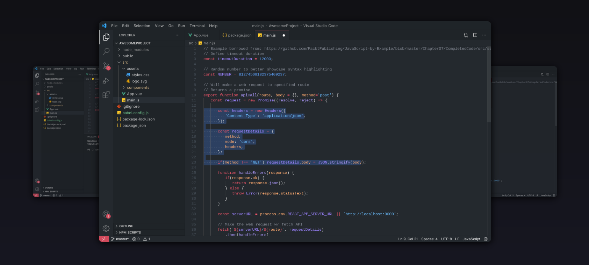

# Boris Theme for Visual Studio Code

Based on the GitHub Dark theme by [GitHub](https://marketplace.visualstudio.com/items?itemName=GitHub.github-vscode-theme)

## Installation

1. Open **Extensions** sidebar panel in Visual Studio Code. `View → Extensions`
2. Search for `BorisTheme`
3. Click **Install** to install it.
4. Code > Preferences > Color Theme > **Boris Theme**

## Screenshots

